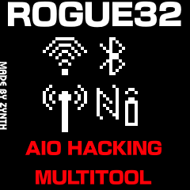

<h1 align="center">- Rogue32 Made By Zynth -</h1>

  
  <h3 align="center">A small and compact pentesting tool.</h3>

---

## Rogue32
The Rogue32 Is a small pentesting tool designed for portability and functionality, it offers multiple functions like:
- Wifi (Sniffers, Spamming, Evil portal)
- Bluetooth (BLE Advertise spam, Sniffer)
- nRF24 (BLE Jammer, 2.4 gHz jammer)

                                                                    
JAMMING IS ILLEGAL! JAM AT YOUR OWN RISK!!

the nRF24, Bluetooth and Wifi functions disrupt:
Bluetooth speakers, RC drones, Wifi signals, anything around 2.4gHz

---
## Functions

### WiFi
- Packet Monitor
- Evil Portal
- AP Spam

### Bluetooth/BLE
- BT Scan
- BT Device Spam
- BT Sniffer

### nRF24
- RF Packet Monitor
- 2.4 gHz Jammer

### Config
- GUI Color
- nRF Power
- nRF Data rate

If you have any suggestions, join the discord
---

## Hardware - Make your own Rogue32 V2

### **Required:**  
- ESP32 Dev Module (38 PIN MODULE NEEDED)
- 1.3 inch ST7789 TFT
- 4x Tact Switch

### **Optional:**
- Battery
- nRF24 ( Will throw some errors and restart when using nRF functions )
  

## CONNECTIONS
| ESP32 Pin | TFT Pin               | Buttons          | nRF24     |
|---------------|----------------------|------------------|-----------|
| 5             | CS (Can leave unconnected) |                  | CSN (Chip Select Not Pin) |
| 18            | RST/RES               |                  |           |
| 21            | DC                    |                  |           |
| 23            | MOSI/SDA              |                  | MOSI      |
| 19            | SCK/SCL               |                  | SCK       |
| 3v3           | VCC                   |                  | VCC       |
| GND           | GND                   |                  | GND       |
| 25            |                       | Up Button        |           |
| 14            |                       | Down Button      |           |
| 27            |                       | Select Button    |           |
| 33            |                       | Back Button      |           |
| 4             |                       |                  | CE (Chip Enable Pin) |
| 12            |                       |                  | MISO      |
| 13            |                       |                  |           |

## FLASHING

| OFFSET | FILE |
|---------------|------------------|
| 0x1000           | Bootloader            |
| 0x10000           | .ino.bin              |
| 0x8000            | Partitions          |

## Discord
You can join my Discord server [here](https://discord.gg/bJdgyC7X)

<h1 align="center"> DISCLAIMER </h1>

<h4 align="center">Remember, jamming is illegal, use this tool at your own risk</h4>
